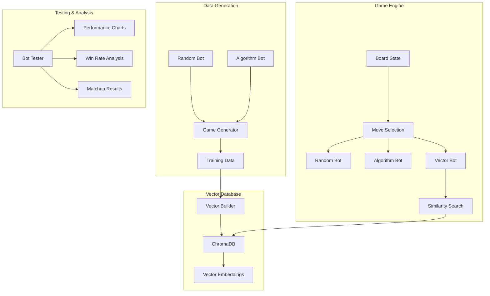
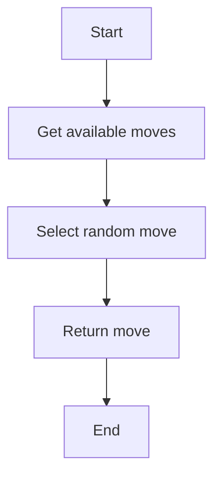
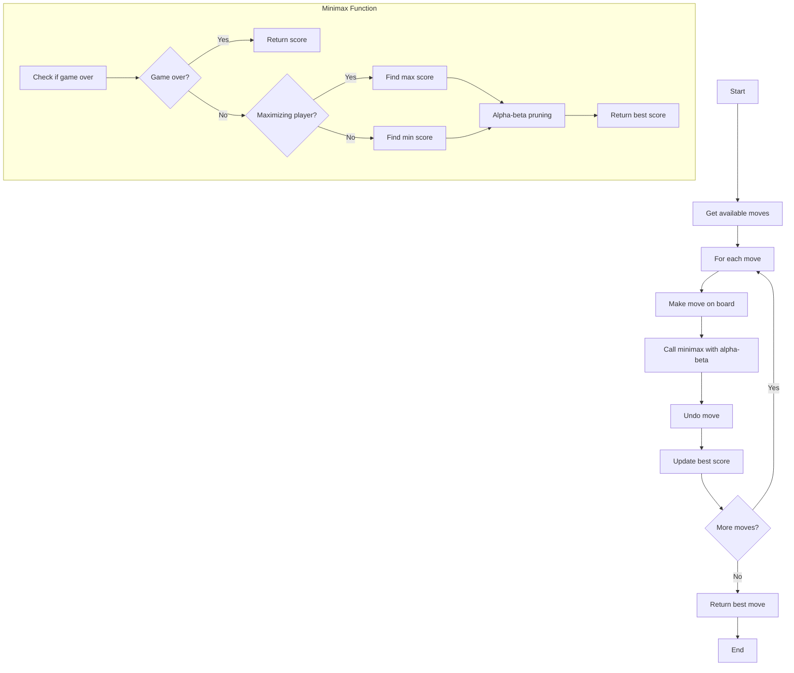
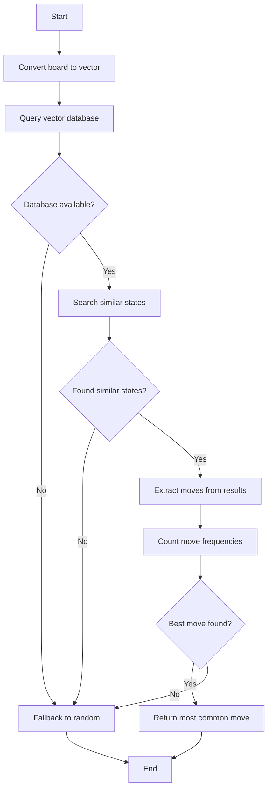
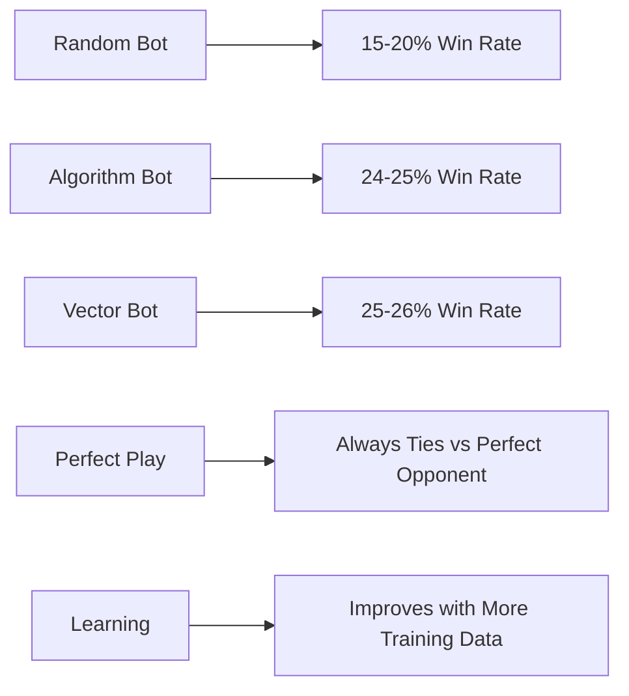
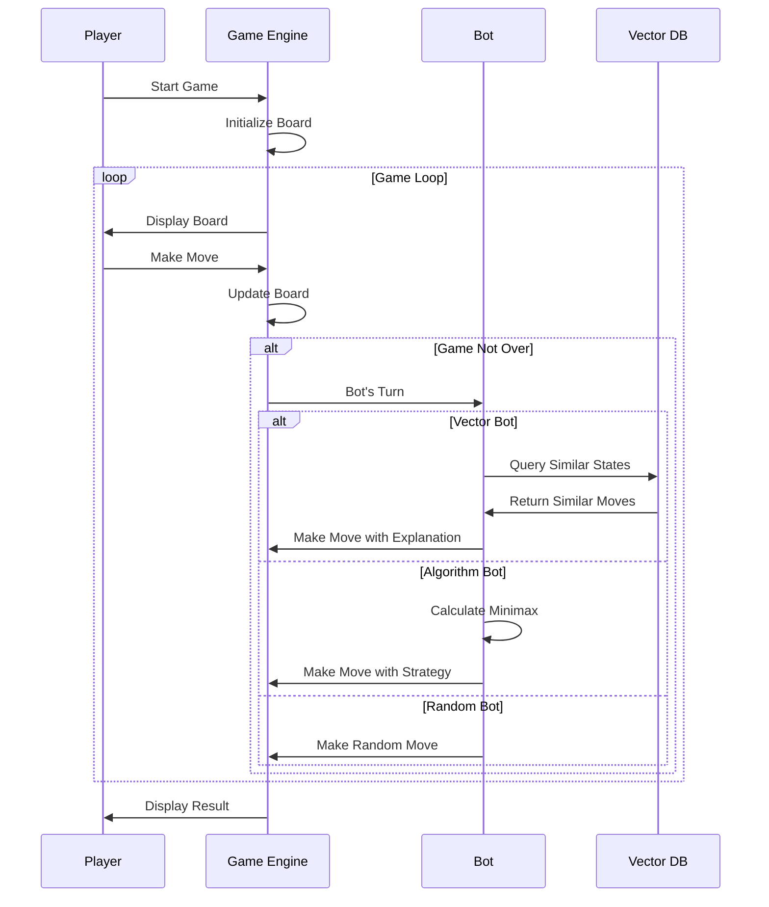

# Vector-OX

A noughts-and-crosses (tic-tac-toe) game with vector database integration and multiple bot modes.

## Features

- **ASCII Terminal Interface**: Beautiful terminal-based game interface using Rich
- **Multiple Bot Modes**:
  - **Random**: Makes random valid moves
  - **Algorithm**: Uses minimax algorithm with alpha-beta pruning
  - **Vector**: Uses vector database similarity search
- **Configurable Board Size**: Support for different board sizes (3x3, 4x4, etc.)
- **Vector Database Integration**: ChromaDB for storing and querying game states
- **Poetry Environment Management**: Modern Python dependency management

## Installation

1. **Clone the repository**:
   ```bash
   git clone <repository-url>
   cd vector-ox
   ```

2. **Setup with Poetry**:
   ```bash
   # Install Poetry if you haven't already
   curl -sSL https://install.python-poetry.org | python3 -
   
   # Install dependencies
   poetry install
   ```

3. **Initial Setup**:
   ```bash
   # Setup with default 3x3 board
   make setup
   
   # Or setup with custom board size
   make setup BOARD_SIZE=4
   ```

## Usage

### Playing the Game

```bash
# Play with default settings (3x3 board, random bot)
make play

# Or use poetry directly
poetry run python -m vector_ox.game

# With custom options
poetry run python -m vector_ox.game --board-size 4 --bot-type algorithm
```

### Available Bot Types

- `random`: Makes random valid moves
- `algorithm`: Uses minimax algorithm (optimal play)
- `vector`: Uses vector database similarity search

### Make Commands

```bash
# Show all available commands
make help

# Setup project with custom board size
make setup BOARD_SIZE=4

# Install dependencies
make install

# Install development dependencies
make dev

# Run tests
make test

# Run linting
make lint

# Format code
make format

# Clean up generated files
make clean

# Generate training data
make generate-data

# Build vector database
make build-vectors

# Test bot performance
make play-test

# Run extensive bot tournament
make play-test-extensive

# Test bots and save results
make play-test-save
```

## Project Structure

```
vector-ox/
├── pyproject.toml          # Poetry configuration
├── Makefile               # Build and utility commands
├── README.md              # This file
├── vector_ox/             # Main package
│   ├── __init__.py
│   ├── game.py            # Main game interface
│   ├── board.py           # Board logic and state management
│   ├── bots.py            # Bot implementations
│   ├── data_generator.py  # Training data generation
│   ├── vector_builder.py  # Vector database builder
│   └── setup.py           # Project setup
├── vector_db/             # Vector database storage (created during setup)
└── training_data.txt      # Generated training data
```

## How It Works

### System Architecture


### Vector Database Integration

1. **Data Generation**: The system generates thousands of games using random and algorithm bots
2. **Vector Representation**: Each board state is converted to a numerical vector
3. **Storage**: Board states and moves are stored in ChromaDB with vector embeddings
4. **Similarity Search**: During gameplay, the vector bot finds similar board states and uses their moves

### Bot Algorithms

#### Random Bot


**Steps:**
1. **Get Available Moves**: Identifies all empty positions on the board
2. **Random Selection**: Uses Python's `random.choice()` to pick any available move
3. **Return Move**: Returns the randomly selected position

#### Algorithm Bot (Minimax with Alpha-Beta Pruning)


**Steps:**
1. **Move Generation**: Creates list of all possible moves
2. **Move Evaluation**: For each move:
   - Temporarily makes the move
   - Calls minimax algorithm to evaluate resulting position
   - Undoes the move
3. **Minimax Algorithm**: 
   - **Terminal Check**: If game is over, return score (win=+10, lose=-10, tie=0)
   - **Recursive Search**: Explore all possible future moves
   - **Score Calculation**: Maximize score for current player, minimize for opponent
4. **Alpha-Beta Pruning**: Skip evaluating branches that won't affect final decision
5. **Best Move Selection**: Return move with highest score

#### Vector Bot (Similarity Search)


**Steps:**
1. **State Vectorization**: Convert current board state to numerical vector (X=1, O=-1, Empty=0)
2. **Database Query**: Search vector database for similar board states
3. **Similarity Matching**: Find board states with similar vector representations
4. **Move Extraction**: Extract moves made in similar situations
5. **Frequency Analysis**: Count how often each move appears in similar states
6. **Confidence Calculation**: Calculate confidence based on frequency of moves
7. **Move Selection**: Return most frequently chosen move from similar states
8. **Fallback Handling**: If no similar states found, use random move

#### Bot Performance Comparison


### Game Flow


### Bot Performance Testing

The project includes comprehensive bot testing capabilities:

```bash
# Quick test (50 games per matchup)
make play-test

# Extensive test (200 games per matchup)
make play-test-extensive

# Test and save results to file
make play-test-save
```

The testing system:
- Pits all bots against each other (random vs vector, random vs algorithm, vector vs algorithm)
- Tracks win rates, losses, and ties
- Generates ASCII bar charts showing performance
- Provides detailed matchup analysis
- Saves results to JSON for further analysis

## Development

### Running Tests

```bash
make test
```

### Code Formatting

```bash
make format
```

### Linting

```bash
make lint
```

## Configuration

### Board Size

The game supports different board sizes. For 3x3 boards, you can use numbers 1-9 for moves. For larger boards, use the `row,col` format.

### Vector Database

The vector database is stored in the `vector_db/` directory and contains:
- Board state vectors
- Associated moves
- Game outcomes

## Troubleshooting

### Vector Database Issues

If the vector bot falls back to random moves, it means:
1. The vector database is empty or corrupted
2. No similar board states were found
3. The vector database connection failed

To rebuild the vector database:
```bash
make generate-data
make build-vectors
```

### Poetry Issues

If you encounter Poetry-related issues:
```bash
# Clear Poetry cache
poetry cache clear --all

# Reinstall dependencies
poetry install --sync
```

## License

This project is open source and available under the MIT License. 
